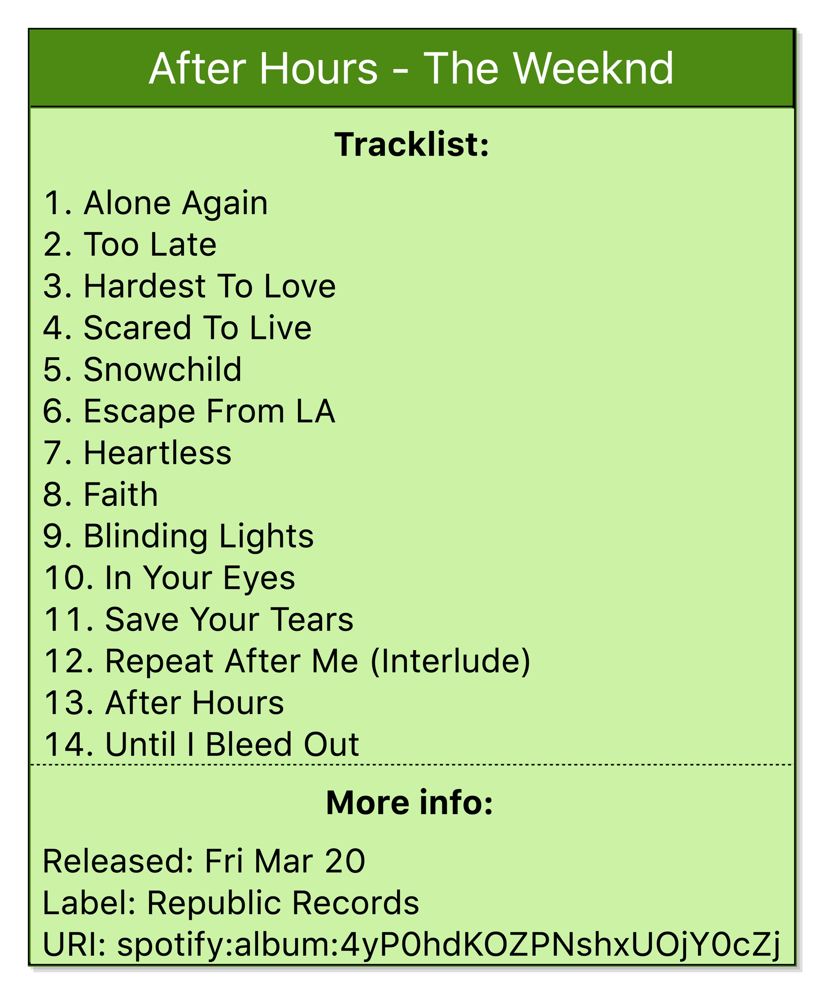
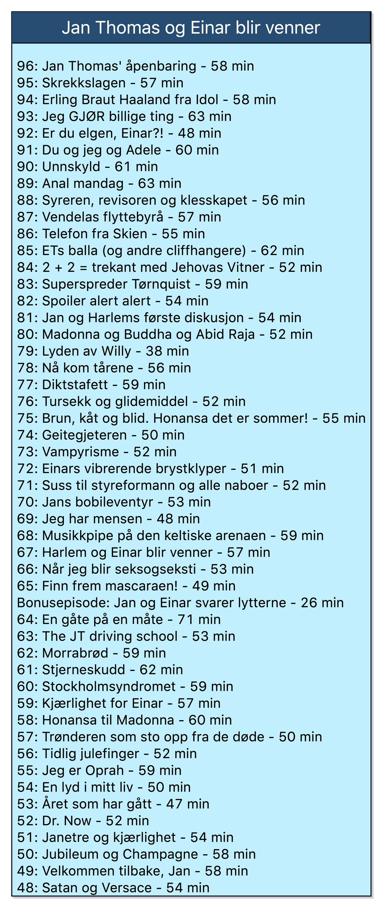

# TDT4250 Semester Project
by Robin Aleksander Finstad

## Description
This project was made to visualize some of the data that can be found at Spotify's api, https://api.spotify.com/. The data is fetched, deserialized and mapped to a Ecore model, this model is then visualized using the Sirius framework.

## Requirements
* Ecore and Eclipse Modelling Framework
* Sirius
* Jackson

## Setup
1. Clone the repo ```clone https://github.com/RullendeRobin/tdt4250-project.git ```
2. Install Jackson library:
     * Navigate to the "Help" tab and select "Install New Software..."
     * Add the Orbit repository, "http://download.eclipse.org/tools/orbit/downloads/drops/R20170919201930/repository"
     * Under "All Bundles" select "Jackson-annotations", "Jackson-core" and "Jackson-databind"
     * Click "Next" and "Finish"
     
The environment should now be ready for use.

## Fetching data and data mapping
All data is contained in JSON files at "tdt4250-project/tree/main/tdt4250.spo.resource/data", there is already prefetched data in this folder. However if desired, one can update the data by navigating to the "tdt4250-project/tree/main/tdt4250.spo.resource/src/fetchData" and running "Main.java". This class calls the "Fetch.java" class which fetches the newest available data from Spotify and writes it to JSON files in the data folder. Thereafter the "Mapper.java" class maps the JSON files to Java objects using the Jackson library, from there the factory pattern is used to map these objects to the Ecore model. The resulting file "sample.xmi" can be found in "tdt4250-project/tree/main/tdt4250.spo.model/model", remember to refresh the model folder after fetching new data.

## Ecore model
The model was made with a focus on playlists, but accomodates several aspects of Spotify. Firstly the model can be split in two areas, separating songs and podcasts. Podcasts are modelled as Shows and each contain their corresponding Episodes. Playlists contain references to Tracks, these Tracks are contained in Albums and both contain one or more Artists. The root object Spotify contains all Playlists, Albums and Shows. All relevant files can be found in "tdt4250-project/tree/main/tdt4250.spo.model".


## Viewpoints
This project uses Sirius to visualize the model, there are in total six diagrams and one table, where some of the diagrams can be reached from each other as indicated below:
  * AllAlbumsDiagram
    * AlbumDiagram
    * TrackDiagram
  * PodcastDiagram
    * ShowDiagram
    * EpisodeDiagram   
  * PlaylistTable

To generate the different diagrams and tables navigate to "tdt4250-project/tree/main/tdt4250.spo.diagram.example" and open representations.aird, here you enable SpoDiagramViewpoint and double-click to generate a new diagram.

### AllAlbumsDiagram


This diagram displays all the available Albums and their Artist, these are based on the Playlists and only Albums containing Tracks that are in the Playlists will be available. By double-clicking an Album you open a new AlbumDiagram which contains all the Tracks from the corresponding Album.

### AlbumDiagram



This diagram displays all the Tracks contained in the Album, these tracks can be double-clicked to access the corresponding TrackDiagram. This diagram also contains a filter and a tool for adding Tracks. The filter is called "Hide Explicit Tracks" and hides all explicit tracks using an OCL expression. To add a Track to the Album simply navigate to "Album Tools" and drag-and-drop the "Add Track" onto the Album object. The Track's Album is set automatically and the rest of the information can be filled in manually.

### TrackDiagram


The TrackDiagram displays information about the selected Track, the duration is transformed from milliseconds to a minute-format using an OCL expression and the URI can be pasted into a browser to open the current Track in Spotify.

### PodcastDiagram


This diagram displays the available Shows and the total amount of Episodes available, a Show can be double-clicked to open a ShowDiagram.

### ShowDiagram



The ShowDiagram displays all the available Episodes and their duration in minutes. This diagram also contains a filter and a tool for adding more Episodes. The filter is called "Short Episodes Only" and hides all Episodes that are longer than 45 minutes. The tool for adding more Episodes can be found under "Show Tools", once again you simply drag-and-drop "Add Episode" onto the Show object. Once all the relevant information has been filled in the Episode's duration will automatically appear next to it's title in the diagram.

### EpisodeDiagram


This diagram displays information about the selected Episode, like the release date and the URI, which can can be pasted in a browser to open the Episode directly in Spotify.

### PlaylistTable


The PlaylistTable display data from the "Top 50 Global" playlist and includes features such as automatic numbering based on the posisition in the list and only displaying "Explicit" if the corresponding variable is true.

